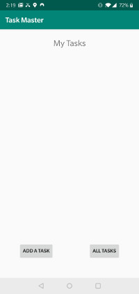
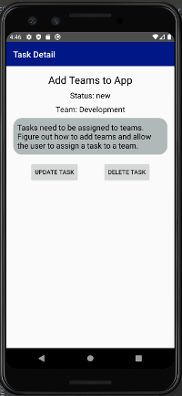
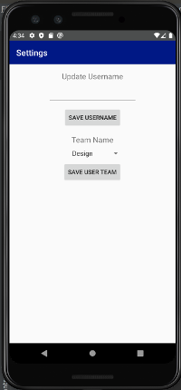
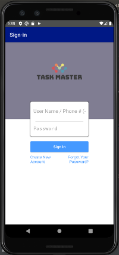
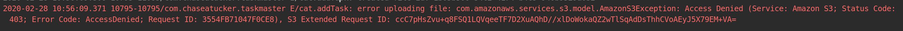

# Task Master
Android app used to manage tasks for teams. This includes adding, assigning, tracking and removing tasks.

## Change Log
* 2/11/2020: Created main, add task and and all tasks activities. Created buttons to navigate to those pages and add task form.
  * 
* 2/12/2020: Created settings activity to all user to update username, a task details activity, three hard-coded task detail pages.
  * 
* 2/23/2020: Added teams, added ability to update and delete tasks, added ability for user to change team.
  * 
* 2/25/2020: Added authentication
  * 
* 2/27/2020: Cannot seem to get S3 working
  * 